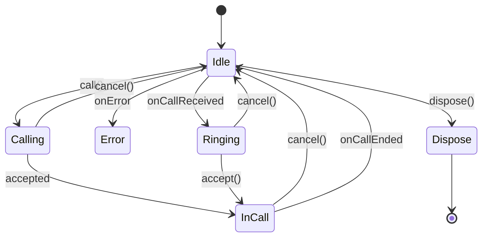

# Call Service

This document describes the call service interface usage and its state.
This service is used to make calls to the peer via a signaling server.

## Call Service state

The following table describes the state of the call service interface.

| State     | Description                                                                                 |
|-----------|---------------------------------------------------------------------------------------------|
| `Idle`    | The call service is idle and ready to make a call.                                          |
| `Calling` | The call service is calling the peer.                                                       |
| `Ringing` | The call service has received a call from a peer and waiting for an answer (accept/reject). |
| `InCall`  | There is an active call session between the peers.                                          |
| `Error`   | The call service has encountered an error                                                   |

### call-service-state



## Call Service methods and fields

All the methods in the call service are non blocking and they will return immediately.

- `fun call(peer: P)` - Call the peer. This will send an offer to the peer via the signaling server.
  This method will do nothing if the call service is not in the `Idle` state.
  As shown in the state diagram [call-service-state](#call-service-state), the call service
  will move to the `Calling` state after calling the `call` method where it awaits till the
  OFFER_TIMEOUT millis for the answer
  from the peer. there are two possible outcomes of the call method:
    - If the peer accepts the call withing the time limit, the call service will move to
      the `InCall` state.

    - If the peer rejects the call or the waiting time for the answer has out, the call service will
      move to the `Idle` state.

- `fun cancel()` - This works differently in three states:
    - If the call service is in the `Calling` state, it will cancel the outgoing offer and move to
      the `Idle` state. This is automatically called when the waiting time for the answer has out.
    - If the call service is in the `InCall` state, it will end the call session and move to the
      `Idle` state.
    - If the call service is in the `Ringing` state, it will cancel the incoming offer and move to
      the `Idle` state.

- `fun accept()` - This method will accept the incoming offer and move to the `InCall` state.

- `fun dispose()` - This method will dispose the call service and move to the `Dispose` state.

- `val serviceState: StateFlow<State>` - A flow of the call service state. The consumer can listen to
  this flow to get the state of the call service.

## Signaling the Offer/Answer via the signaling server

The call service does not handle the signaling of the offer/answer. It just delicate the signaling
process to `Signal` interface. The `Signal` interface is responsible for signaling the offer/answer
via the signaling server.
Consumers of the call service should implement the `Signal` interface to handle the signaling of the
offer/answer.

## Signal interface

The `Signal` interface gives a way to send/receive the offer/answer and to controll the call
session. You are required to implement the `Signal` interface to handle the signaling of the
offer/answer. it has the following methods: to establish a call session and to control the call
session. Signal interface methods and fields:

- `sendOffer(offer: Offer)` - you should implement this method to send an offer to the peer via the
  signaling server.

- `sendAnswer(answer: Answer)` - Sends a accept/reject answer to the peer via the signaling server.

- `cancelSession()` - Implement this method to signal to other peer to end the call session.

- `cancelOffer()` - Implement this method to cancel the outgoing offer.

- `incomingOffer: Flow<Offer>` - Provide a flow of incoming offers from the peer. Call Service will
  immediately process an incoming offer if the call service is in the `Idle` state and it will
  transition to the `Ringing` state.

- `incomingAnswer: Flow<Answer>` - Provide a flow of incoming answers from the peer. Call Service
  will immediately process an incoming answer if the call service is in the `Calling` state and it
  will transition to the `InCall` state if the answer is accepted.

- `sessionCloseEvent: Flow<Unit>` - Provide a flow of the session close event.

## Offer/Answer

The `Offer` and `Answer` are the data classes that represent the offer and answer of the call.
The `Offer`
contains the media format, candidates, timestamp, expiry time and the information about the
sending/receiving peer.

The Offer could be looked as Incoming Offer or Outgoing Offer. In the case of incoming offer, peer
describes the caller,
and in the case of outgoing offer, peer describes the callee.

```kotlin
data class Offer<P>(
    val mediaFormat: List<MediaFormat>,
    val candidates: List<IceCandidate>,
    val timestamp: Long,
    val expiryTime: Long,
    val peer: P
)
```

The `Answer` contains the accept/reject answer, timestamp, and the information about the sending

```kotlin
data class Answer<P>(
    val accept: Boolean,
    val peer: P,
    val timestamp: Long,
    val mediaFormat: List<MediaFormat>,
    val candidates: List<IceCandidate>,
)   
```
