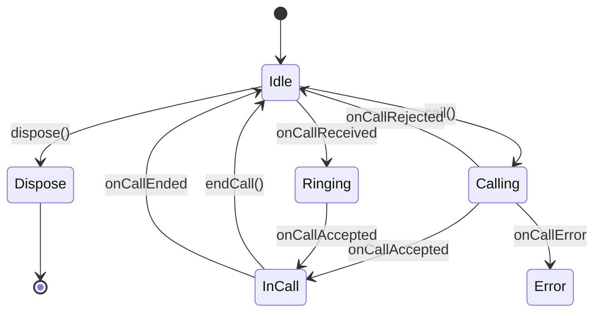

# Call Service

This document describes the call service interface usage and its state.
This service is used to make calls to the peer via a signaling server.

## Call Service state

The following table describes the state of the call service interface.

| State     | Description                                                                                 |
|-----------|---------------------------------------------------------------------------------------------|
| `Idle`    | The call service is idle and ready to make a call.                                          |
| `Calling` | The call service is calling the peer.                                                       |
| `Ringing` | The call service has received a call from a peer and waiting for an answer (accept/reject). |
| `InCall`  | There is an active call session between the peers.                                          |
| `Error`   | The call service has encountered an error                                                   |



## Signaling the Offer/Answer via the signaling server

The call service does not handle the signaling of the offer/answer. It just delicate the signaling
process to `Signal` interface. The `Signal` interface is responsible for signaling the offer/answer
via the signaling server.
Consumers of the call service should implement the `Signal` interface to handle the signaling of the
offer/answer.

## Signal interface

The `Signal` interface gives a way to send/receive the offer/answer and to controll the call
session.
it has the following methods: to establish a call session and to control the call session.

Signal interface methods and fields:

- `sendOffer(offer: Offer)` - Sends the offer to the peer via the signaling server.
- `sendAnswer(answer: Answer)` - Sends a accept/reject answer to the peer via the signaling server.
- `endCall()` - Ends the current call session.
- `incomingOffer: Flow<Offer>` - A flow of incoming offers from the peer. Call Service will
  immediately process an incoming offer if the call service is in the `Idle` state and it will
  transition to the `Ringing` state and wait for the consumer to accept/reject the call.

  If the call service is not in the `Idle` state, It will put the incoming offer in the queue and
  process it when the call service is in the `Idle` state and if the incoming offer is not expired
  it will process it and move to the `Ringing` state otherwise it will ignore the offer.

- `incomingAnswer: Flow<Answer>` - A flow of incoming answers from the peer. Call Service will
  immediately process an incoming answer if the call service is in the `Calling` state and it will
  transition to the `InCall` state if the answer is a accept answer otherwise call service will move
  to `Idle` state.

  If the call service is not in the `Calling` state, it will ignore the incoming answer this could
  be possible if the consumer has canceled the outgoing offer or the waiting time for the answer has
  out and at a later time it receive an answer.

- `cancelOutgoingOffer()` - Cancels the outgoing offer if the call service is in the `Calling`
  state. This may be called when the consumer wants to cancel the outgoing offer or the waiting time
  for the answer has out.

- `closeCallEvent: Flow<Unit>` - A flow of close call events. This flow will emit a unit when the call session is ended by the peer.

Call service will listen to the `incomingOffer` and `incomingAnswer` flow to process the incoming offers and answers. It will also listen to the `closeCallEvent` to end the call session. All of the
methods of the `Signal` may throw an exception if there is an error in the signaling process. You
don't need to handle the exceptions in the consumer code, the call service will handle the
exceptions and move to the `Error` state. The consumer can listen to the `CallService#stateFlow` to
get the state of the call service.

## Offer/Answer

The `Offer` and `Answer` are the data classes that represent the offer and answer of the call.
The `Offer`
contains the media format, candidates, timestamp, expiry time and the information about the
sending/receiving peer.

The Offer could be looked as Incoming Offer or Outgoing Offer. In the case of incoming offer, peer
describes the caller,
and in the case of outgoing offer, peer describes the callee.

```kotlin
data class Offer<P>(
    val mediaFormat: List<MediaFormat>,
    val candidates: List<IceCandidate>,
    val timestamp: Long,
    val expiryTime: Long,
    val peer: P
)
```

The `Answer` contains the accept/reject answer, timestamp, and the information about the sending

```kotlin
data class Answer<P>(
    val accept: Boolean,
    val peer: P,
    val timestamp: Long,
   val mediaFormat: List<MediaFormat>,
    val candidates: List<IceCandidate>,
    val peer: P,
)
```
